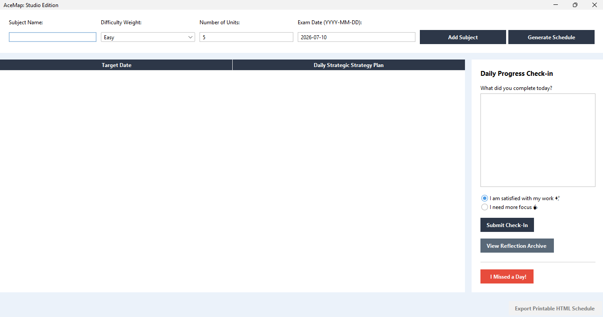
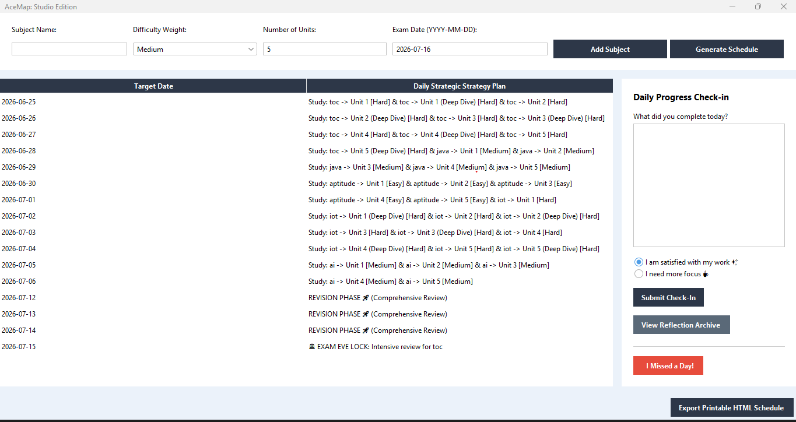
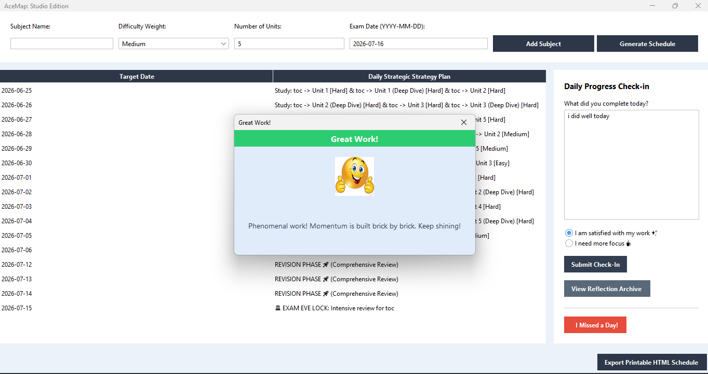
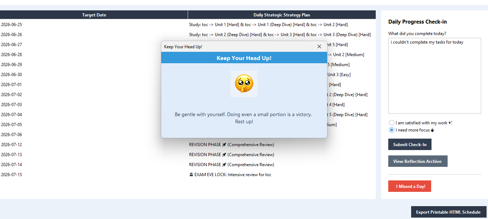
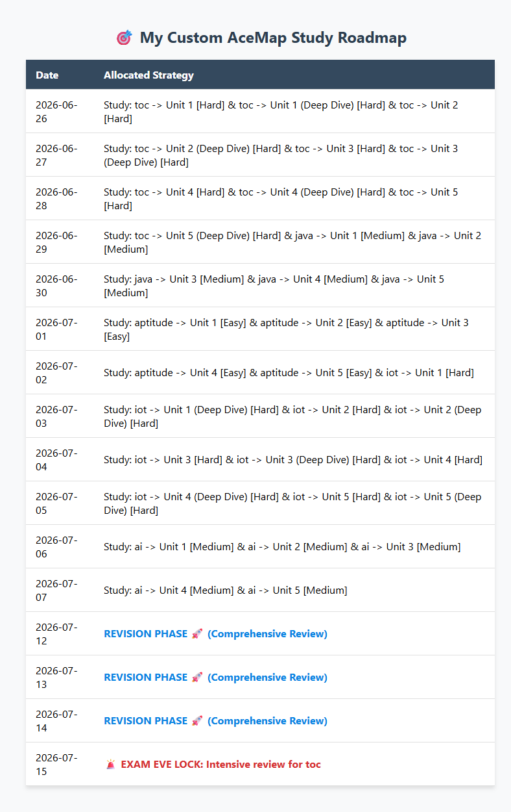

# 🎯 AceMap: Exam Preparation Strategy Studio

AceMap is a modern, responsive desktop application built with **Java Swing** and the **FlatLaf** design library. It is specifically engineered to combat "Planning Paralysis" by automatically breaking down multi-subject academic curriculums into personalized, unit-aware, and dynamically balanced daily study roadmaps.

---

## 📸 Guided Interface Walkthrough

Below is a step-by-step visual tour of the AceMap Studio environment in action.

### 1️⃣ Clean Studio Workspace

* **Context:** The initial state of the application. It showcases a refined `GridBagLayout` configuration that ensures input parameters (Subject Name, Difficulty Weight, Number of Units, and Target Exam Dates) remain aligned.

### 2️⃣ Multi-Subject Scheduling Grid

* **Context:** The schedule generated after logging multiple engineering subjects. When preparation windows are tight, the core multitasking algorithm bundles dynamic unit blocks together onto the same calendar date using responsive HTML row joining.

### 3️⃣ High-Satisfaction Check-In & Animation Card

* **Context:** Triggered when a student logs an accomplishment note and checks *"I am satisfied with my work"*. The system pops up a calming light pastel-blue modal dialog rendering a custom success emoji and launches a **Physics-Based Confetti Particle Simulation Engine** running on a background thread.

### 4️⃣ Supportive Well-Being Check-In Panel

* **Context:** Triggered when a student checks *"I need more focus"*. The studio dynamically replaces praise with supportive, grounding reminders to protect student well-being and combat burnout, without running intense animations.

### 5️⃣ Printable HTML Document Report Export

* **Context:** The standalone, production-ready HTML document sheet generated instantly by clicking **"Export Printable HTML Schedule"**. It parses calendar objects and renders them into an elegantly styled CSS web sheet layout with color-coded revision indicators for easy offline printing.

---

## 🚀 Core Engineered Features

* 🧮 **Proportional Workload Distribution:** Evaluates cumulative syllabus sizes alongside relative subject friction values rather than breaking up calendar dates blindly.
* 🛡️ **Adaptive Overload Fallback Shifter:** If a user logs a missed day by clicking **"I Missed a Day!"**, a built-in rescheduling buffer shifts the remaining unit timeline down by re-balancing tomorrow's tasks without double-booking individual dates.
* 🏛️ **Milestone Archive Portfolio:** Operates an active session memory array (`ArrayList`) that caches student check-in notes chronologically, enabling users to view a comprehensive ledger of their review milestones.
* ⏳ **Locked Final Review Matrix:** Mathematically reserves a hard cutoff window of **exactly 4 days** at the tail-end of the timeline for high-level revision and comprehensive crunch review.
* 🚨 **Exam Eve Isolation override:** Automatically isolates the final 24 hours preceding day one of the examination schedule exclusively to the primary target subject.

---

## 🧠 The Scheduling Core: Mathematical Formula

The engine evaluates student inputs to guarantee that more demanding curriculum areas receive proper coverage. When a schedule is requested, the system maps out available time by evaluating:

### 1. The Cumulative Workload Weight
The algorithm quantifies the total work across all subjects by mapping difficulty strings to numeric constants ($\text{Hard} = 3$, $\text{Medium} = 2$, $\text{Easy} = 1$) and multiplying them by individual unit sets:

$$\text{Total Workload Weight} = \sum_{i=1}^{n} (\text{Subject Weight}_i \times \text{Unit Count}_i)$$

### 2. Temporal Boundaries Configuration
The time frame is structured by subtracting the custom locked 4-day revision phase from the total days remaining until the examination begins:

$$\text{Available Study Days} = \text{Total Days Between Now and Exam Date} - 4$$

### 3. Proportional Day Slicing
For every individual unit item added to the master queue, its proportional share of days is calculated:

$$\text{Days For This Unit} = \text{round}\left( \frac{\text{Subject Weight}}{\text{Total Workload Weight}} \times \text{Available Study Days} \right)$$

*If a compressed timeline evaluates this to 0, a system fallback overrides it to 1 day or bundles concurrent elements using an HTML layout breaker link ` ` to maintain scheduling integrity.*

---

## 🛠️ Software Architecture & Dependencies

* **Language Platform:** Java (JDK 17 or higher)
* **User Interface Framework:** Java Swing (`GridBagLayout` configuration grid)
* **Look & Feel Theme Engine:** FlatLaf Light Core (`flatlaf-3.7.1.jar`)
* **Design Pattern Alignment:** Model-View-Controller (MVC) decoupling paradigm